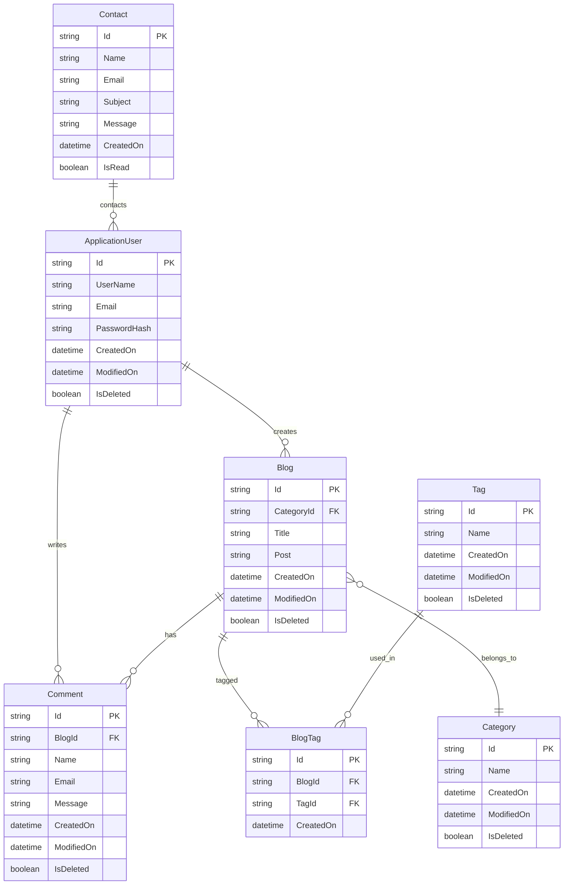

# StandBlog

<div align="center">


**A modern, enterprise-grade blog management system built with ASP.NET Core 9.0**

[](https://dotnet.microsoft.com/download)
[](https://dotnet.microsoft.com/aspnet/core)
[](https://docs.microsoft.com/en-us/ef/)
[](https://www.microsoft.com/en-us/sql-server)
[](LICENSE)

[Features](#-features) • [Installation](#-installation) • [Documentation](#-documentation) • [API Reference](#-api-reference) • [Contributing](#-contributing)

</div>

---

## 📋 Table of Contents

- [Overview](#-overview)
- [Features](#-features)
- [Architecture](#-architecture)
- [Technology Stack](#-technology-stack)
- [Installation](#-installation)
- [Configuration](#-configuration)
- [API Documentation](#-api-documentation)
- [Database Schema](#-database-schema)
- [Security](#-security)
- [Performance](#-performance)
- [Testing](#-testing)
- [Deployment](#-deployment)
- [Contributing](#-contributing)
- [License](#-license)

## 🎯 Overview

StandBlog is a comprehensive, enterprise-ready blog management platform designed for modern web applications. Built with ASP.NET Core 9.0, it provides a robust foundation for content management with advanced features including multi-user authentication, content categorization, comment moderation, and responsive design.

### Key Highlights

- **🏗️ Modern Architecture**: Clean separation of concerns with MVC pattern
- **🔐 Enterprise Security**: ASP.NET Core Identity with role-based authorization
- **📱 Responsive Design**: Mobile-first approach with Bootstrap 5
- **⚡ High Performance**: Optimized queries and caching strategies
- **🛡️ Data Validation**: Comprehensive input validation with FluentValidation
- **📊 Admin Dashboard**: Intuitive content management interface

## 📸 Screenshots

### 🌐 Public Interface

#### Homepage
<div align="center">
  
  <p><em>Modern, responsive homepage with featured blog posts and navigation</em></p>
</div>

#### Blog Detail
<div align="center">
  
  <p><em>Detailed blog post view with comments and social sharing</em></p>
</div>

#### Contact Page
<div align="center">
  
  <p><em>Contact form with validation and responsive design</em></p>
</div>

#### User Registration
<div align="center">
  
  <p><em>User registration form with validation</em></p>
</div>

#### User Login
<div align="center">
  
  <p><em>User login form with remember me option</em></p>
</div>

### 🔧 Admin Dashboard

#### Dashboard Overview
<div align="center">
  
  <p><em>Comprehensive admin dashboard with analytics and quick actions</em></p>
</div>

#### Blog Management
<div align="center">
  
  <p><em>Blog post creation and management interface</em></p>
</div>

#### Category Management
<div align="center">
  
  <p><em>Category organization and management system</em></p>
</div>

#### Comment Moderation
<div align="center">
  
  <p><em>Comment moderation and approval system</em></p>
</div>

#### Contact Management
<div align="center">
  
  <p><em>Contact message management and response system</em></p>
</div>

### 📱 Mobile Responsive Design

#### Mobile Homepage
<div align="center">
  
  <p><em>Mobile-optimized homepage design</em></p>
</div>

#### Mobile Blog View
<div align="center">
  
  <p><em>Responsive blog post view on mobile devices</em></p>
</div>


## ✨ Features

### 🌐 Public Features
- **📰 Blog Management**: Dynamic blog post creation and management
- **🏷️ Content Organization**: Advanced categorization and tagging system
- **💬 Interactive Comments**: Real-time comment system with moderation
- **🔍 Search & Filter**: Advanced content discovery with category and tag filters
- **📱 Responsive UI**: Mobile-optimized interface across all devices
- **📧 Contact System**: Integrated contact form with admin notifications
- **🎨 Customizable Themes**: Flexible theming system for brand customization

### 🔧 Admin Dashboard
- **👤 User Management**: Complete user administration with role-based access
- **📝 Content Editor**: Rich text editor for blog post creation and editing
- **📊 Analytics Dashboard**: Content performance metrics and user engagement
- **🗂️ Category Management**: Hierarchical category organization
- **🏷️ Tag Administration**: Dynamic tag creation and management
- **💬 Comment Moderation**: Advanced comment management and approval system
- **📈 Content Analytics**: Detailed content performance tracking
- **⚙️ System Configuration**: Comprehensive system settings management

### 🔒 Security Features
- **🔐 Authentication**: Multi-factor authentication support
- **🛡️ Authorization**: Role-based access control (RBAC)
- **🔒 Data Protection**: Encrypted sensitive data storage
- **🛡️ CSRF Protection**: Cross-site request forgery prevention
- **🔍 Input Validation**: Comprehensive input sanitization and validation
- **📝 Audit Logging**: Complete activity tracking and logging

## 🏗️ Architecture

### System Architecture

StandBlog follows a clean, layered architecture pattern that promotes maintainability, testability, and scalability:

```
┌─────────────────────────────────────────────────────────────┐
│                    Presentation Layer                       │
├─────────────────────────────────────────────────────────────┤
│  Public Views  │  Admin Dashboard  │  API Controllers      │
├─────────────────────────────────────────────────────────────┤
│                    Business Logic Layer                     │
├─────────────────────────────────────────────────────────────┤
│  Controllers  │  ViewComponents  │  Services  │  Validators │
├─────────────────────────────────────────────────────────────┤
│                    Data Access Layer                        │
├─────────────────────────────────────────────────────────────┤
│  Entity Framework Core  │  Repository Pattern  │  Migrations │
├─────────────────────────────────────────────────────────────┤
│                    Database Layer                           │
├─────────────────────────────────────────────────────────────┤
│              SQL Server Database                           │
└─────────────────────────────────────────────────────────────┘
```

### Project Structure

```
StandBlog/
├── 📁 Areas/
│   └── 📁 Dashboard/                    # Admin Management Area
│       ├── 📁 Controllers/              # Admin Controllers
│       │   ├── AccountController.cs     # User Authentication
│       │   ├── BlogsController.cs       # Blog Management
│       │   ├── CategoriesController.cs  # Category Management
│       │   ├── TagsController.cs        # Tag Management
│       │   ├── CommentsController.cs    # Comment Moderation
│       │   └── ContactsController.cs    # Contact Management
│       ├── 📁 Models/                   # View Models
│       │   ├── LoginViewModel.cs        # Login Form Model
│       │   └── RegisterViewModel.cs     # Registration Form Model
│       ├── 📁 Validators/               # Input Validation
│       │   ├── LoginViewModelValidator.cs
│       │   └── RegisterViewModelValidator.cs
│       └── 📁 Views/                    # Admin Views
│           ├── Account/                 # Authentication Views
│           ├── Blogs/                   # Blog Management Views
│           ├── Categories/              # Category Management Views
│           ├── Tags/                    # Tag Management Views
│           ├── Comments/                # Comment Management Views
│           └── Contacts/                # Contact Management Views
├── 📁 Controllers/                      # Public Controllers
│   ├── HomeController.cs                # Homepage Controller
│   ├── BlogsController.cs               # Public Blog Controller
│   └── ContactController.cs             # Contact Form Controller
├── 📁 Data/
│   └── ApplicationDbContext.cs          # Database Context
├── 📁 Models/
│   ├── 📁 Entities/                     # Domain Models
│   │   ├── BaseEntity.cs                # Base Entity Class
│   │   ├── ApplicationUser.cs           # User Entity
│   │   ├── Blog.cs                      # Blog Post Entity
│   │   ├── Category.cs                  # Category Entity
│   │   ├── Tag.cs                       # Tag Entity
│   │   ├── Comment.cs                   # Comment Entity
│   │   ├── Contact.cs                   # Contact Entity
│   │   └── BlogTag.cs                   # Blog-Tag Junction Entity
│   ├── 📁 Mappings/                     # Entity Framework Configurations
│   │   ├── BlogConfiguration.cs
│   │   ├── CategoryConfiguration.cs
│   │   ├── TagConfiguration.cs
│   │   ├── CommentConfiguration.cs
│   │   ├── ContactConfiguration.cs
│   │   └── BlogTagConfiguration.cs
│   └── 📁 Validators/                   # FluentValidation Rules
│       ├── BlogValidator.cs
│       ├── CategoryValidator.cs
│       ├── TagValidator.cs
│       ├── CommentValidator.cs
│       ├── ContactValidator.cs
│       └── BlogTagValidator.cs
├── 📁 ViewComponents/                   # Reusable UI Components
│   ├── BannerViewComponent.cs           # Hero Banner Component
│   ├── CategoriesViewComponent.cs       # Category List Component
│   ├── RecentPostsViewComponent.cs      # Recent Posts Component
│   ├── TagCloudsViewComponent.cs        # Tag Cloud Component
│   ├── BlogCommentsViewComponent.cs     # Comments Component
│   └── BlogTagsViewComponent.cs         # Blog Tags Component
├── 📁 Views/                           # Public Views
│   ├── 📁 Home/                        # Homepage Views
│   ├── 📁 Blogs/                       # Blog Views
│   ├── 📁 Contact/                     # Contact Views
│   └── 📁 Shared/                      # Shared Layout Views
├── 📁 wwwroot/                         # Static Assets
│   ├── 📁 assets/                      # Application Assets
│   │   ├── 📁 css/                     # Stylesheets
│   │   ├── 📁 js/                      # JavaScript Files
│   │   ├── 📁 images/                  # Image Assets
│   │   └── 📁 fonts/                   # Font Files
│   └── 📁 vendor/                      # Third-party Libraries
└── 📄 Program.cs                       # Application Entry Point
```

## 🗄️ Database Schema

### Entity Relationship Diagram



### Core Entities

| Entity | Description | Key Properties |
|--------|-------------|----------------|
| **ApplicationUser** | User authentication and profile management | Id, UserName, Email, PasswordHash |
| **Blog** | Main content entity for blog posts | Id, Title, Post, CategoryId |
| **Category** | Content categorization system | Id, Name |
| **Tag** | Flexible content tagging system | Id, Name |
| **Comment** | User-generated comments on blog posts | Id, BlogId, Name, Email, Message |
| **BlogTag** | Many-to-many relationship between blogs and tags | Id, BlogId, TagId |
| **Contact** | Contact form submissions | Id, Name, Email, Subject, Message |

## 🛠️ Technology Stack

### Backend Technologies
- **Framework**: ASP.NET Core 9.0
- **Language**: C# 12.0
- **Database**: Microsoft SQL Server 2022
- **ORM**: Entity Framework Core 9.0
- **Authentication**: ASP.NET Core Identity
- **Validation**: FluentValidation 12.0
- **Dependency Injection**: Built-in ASP.NET Core DI Container

### Frontend Technologies
- **UI Framework**: Bootstrap 5.3
- **JavaScript**: ES6+ with modern browser support
- **CSS**: Custom CSS3 with responsive design
- **Icons**: FontAwesome 6.0
- **Fonts**: Google Fonts integration

### Development Tools
- **IDE**: Visual Studio 2022 / Visual Studio Code
- **Version Control**: Git
- **Package Manager**: NuGet
- **Database Tools**: SQL Server Management Studio
- **API Testing**: Postman / Swagger

## 🚀 Installation

### Prerequisites

Before you begin, ensure you have the following installed:

- [.NET 9.0 SDK](https://dotnet.microsoft.com/download/dotnet/9.0)
- [SQL Server 2022](https://www.microsoft.com/en-us/sql-server/sql-server-downloads) or [SQL Server LocalDB](https://docs.microsoft.com/en-us/sql/database-engine/configure-windows/sql-server-express-localdb)
- [Visual Studio 2022](https://visualstudio.microsoft.com/downloads/) or [Visual Studio Code](https://code.visualstudio.com/)
- [Git](https://git-scm.com/downloads)

### Quick Start

1. **Clone the Repository**
   ```bash
   git clone https://github.com/yourusername/StandBlog.git
   cd StandBlog
   ```

2. **Restore Dependencies**
   ```bash
   dotnet restore
   ```

3. **Configure Database Connection**
   
   Update the connection string in `appsettings.json`:
   ```json
   {
     "ConnectionStrings": {
       "DefaultConnection": "Server=(localdb)\\mssqllocaldb;Database=StandBlogDb;Trusted_Connection=true;MultipleActiveResultSets=true"
     }
   }
   ```

4. **Run Database Migrations**
   ```bash
   dotnet ef database update
   ```

5. **Build and Run the Application**
   ```bash
   dotnet build
   dotnet run
   ```

6. **Access the Application**
   - **Public Site**: `https://localhost:5001`
   - **Admin Dashboard**: `https://localhost:5001/Dashboard`

### Docker Installation (Alternative)

If you prefer using Docker:

1. **Build the Docker Image**
   ```bash
   docker build -t standblog .
   ```

2. **Run with Docker Compose**
   ```bash
   docker-compose up -d
   ```

### Initial Setup

After the first run, you'll need to:

1. **Create an Admin Account**
   - Navigate to `/Dashboard/Account/Register`
   - Create your administrator account
   - Log in with your credentials

2. **Seed Initial Data** (Optional)
   - Create sample categories
   - Add sample blog posts
   - Configure system settings

## ⚙️ Configuration

### Database Configuration

Configure your database connection in `appsettings.json`:

```json
{
  "ConnectionStrings": {
    "DefaultConnection": "Server=(localdb)\\mssqllocaldb;Database=StandBlogDb;Trusted_Connection=true;MultipleActiveResultSets=true"
  },
  "Logging": {
    "LogLevel": {
      "Default": "Information",
      "Microsoft.AspNetCore": "Warning"
    }
  },
  "AllowedHosts": "*"
}
```

### Authentication Configuration

Customize authentication settings in `Program.cs`:

```csharp
builder.Services.ConfigureApplicationCookie(options => 
{
    options.LoginPath = "/Dashboard/Account/Login";
    options.LogoutPath = "/Home/Index";
    options.AccessDeniedPath = "/Dashboard/Account/AccessDenied";
    options.ExpireTimeSpan = TimeSpan.FromHours(24);
    options.SlidingExpiration = true;
});
```

### Email Configuration (Optional)

For contact form functionality, configure SMTP settings:

```json
{
  "EmailSettings": {
    "SmtpServer": "smtp.gmail.com",
    "SmtpPort": 587,
    "SmtpUsername": "your-email@gmail.com",
    "SmtpPassword": "your-app-password",
    "FromEmail": "noreply@standblog.com",
    "FromName": "StandBlog"
    }
}
```

## 🔒 Security

### Authentication & Authorization

StandBlog implements comprehensive security measures:

- **ASP.NET Core Identity**: Secure user authentication
- **Role-Based Authorization**: Granular permission system
- **Password Policies**: Configurable password requirements
- **Account Lockout**: Protection against brute force attacks
- **CSRF Protection**: Cross-site request forgery prevention
- **Input Validation**: Comprehensive data validation with FluentValidation

### Security Best Practices

1. **Password Requirements**
   ```csharp
   services.Configure<IdentityOptions>(options =>
   {
       options.Password.RequireDigit = true;
       options.Password.RequireLowercase = true;
       options.Password.RequireNonAlphanumeric = true;
       options.Password.RequireUppercase = true;
       options.Password.RequiredLength = 8;
   });
   ```

2. **HTTPS Enforcement**
   ```csharp
   app.UseHttpsRedirection();
   app.UseHsts();
   ```

3. **Data Protection**
   ```csharp
   services.AddDataProtection()
           .SetApplicationName("StandBlog")
           .PersistKeysToFileSystem(new DirectoryInfo(@"C:\keys"));
   ```

## 📊 Performance

### Optimization Strategies

- **Entity Framework Optimization**: Efficient query patterns and lazy loading
- **Caching**: In-memory caching for frequently accessed data
- **Compression**: Response compression for better performance
- **Static File Optimization**: Minified CSS and JavaScript
- **Database Indexing**: Optimized database indexes for better query performance

### Performance Monitoring

```csharp
// Add performance monitoring
services.AddApplicationInsightsTelemetry();

// Configure response compression
services.AddResponseCompression(options =>
{
    options.EnableForHttps = true;
    options.Providers.Add<BrotliCompressionProvider>();
    options.Providers.Add<GzipCompressionProvider>();
});
```

## 🧪 Testing

### Unit Testing

```bash
# Run unit tests
dotnet test

# Run with coverage
dotnet test --collect:"XPlat Code Coverage"
```

### Integration Testing

```bash
# Run integration tests
dotnet test --filter Category=Integration
```

### Test Structure

```
Tests/
├── Unit/
│   ├── Controllers/
│   ├── Services/
│   └── Validators/
├── Integration/
│   ├── Controllers/
│   └── Database/
└── TestUtilities/
    ├── TestDataBuilder.cs
    └── MockServices.cs
```

## 🚀 Deployment

### Azure Deployment

1. **Create Azure App Service**
   ```bash
   az webapp create --resource-group myResourceGroup --plan myAppServicePlan --name myWebApp --runtime "DOTNET|9.0"
   ```

2. **Deploy Application**
   ```bash
   az webapp deployment source config --name myWebApp --resource-group myResourceGroup --repo-url https://github.com/yourusername/StandBlog.git --branch main --manual-integration
   ```

### Docker Deployment

```dockerfile
FROM mcr.microsoft.com/dotnet/aspnet:9.0 AS base
WORKDIR /app
EXPOSE 80
EXPOSE 443

FROM mcr.microsoft.com/dotnet/sdk:9.0 AS build
WORKDIR /src
COPY ["StandBlog.csproj", "."]
RUN dotnet restore "StandBlog.csproj"
COPY . .
RUN dotnet build "StandBlog.csproj" -c Release -o /app/build

FROM build AS publish
RUN dotnet publish "StandBlog.csproj" -c Release -o /app/publish

FROM base AS final
WORKDIR /app
COPY --from=publish /app/publish .
ENTRYPOINT ["dotnet", "StandBlog.dll"]
```

### Environment Configuration

```bash
# Production environment variables
export ASPNETCORE_ENVIRONMENT=Production
export ConnectionStrings__DefaultConnection="Server=prod-server;Database=StandBlogDb;..."
export EmailSettings__SmtpServer="smtp.production.com"
```

## 📈 Monitoring & Logging

### Application Insights

```csharp
services.AddApplicationInsightsTelemetry(Configuration["ApplicationInsights:ConnectionString"]);
```

### Logging Configuration

```csharp
builder.Logging.AddConsole();
builder.Logging.AddDebug();
builder.Logging.AddEventSourceLogger();
```

## 🤝 Contributing

We welcome contributions to StandBlog! Please follow these guidelines:

### Development Workflow

1. **Fork the Repository**
   ```bash
   git clone https://github.com/yourusername/StandBlog.git
   cd StandBlog
   ```

2. **Create Feature Branch**
   ```bash
   git checkout -b feature/amazing-feature
   ```

3. **Make Changes**
   - Follow the coding standards
   - Add unit tests for new features
   - Update documentation as needed

4. **Commit Changes**
   ```bash
   git commit -m "Add amazing feature"
   ```

5. **Push and Create Pull Request**
   ```bash
   git push origin feature/amazing-feature
   ```

### Coding Standards

- Follow C# naming conventions
- Use meaningful variable and method names
- Add XML documentation for public APIs
- Write unit tests for new functionality
- Ensure all tests pass before submitting PR

### Pull Request Process

1. Update documentation for any API changes
2. Add tests that prove your fix is effective or feature works
3. Ensure all tests pass
4. Request review from maintainers

## 📄 License

This project is licensed under the MIT License - see the [LICENSE](LICENSE) file for details.

## 📞 Support

### Getting Help

- **Documentation**: Check our comprehensive documentation
- **Issues**: Report bugs or request features via [GitHub Issues](https://github.com/yourusername/StandBlog/issues)
- **Discussions**: Join community discussions in [GitHub Discussions](https://github.com/yourusername/StandBlog/discussions)
- **Email**: Contact us at support@standblog.com

### Community

- **Discord**: Join our Discord server for real-time discussions
- **Twitter**: Follow [@StandBlog](https://twitter.com/standblog) for updates
- **Blog**: Read our technical blog at [blog.standblog.com](https://blog.standblog.com)

## 🙏 Acknowledgments

- **Microsoft**: For the amazing ASP.NET Core framework
- **Entity Framework Team**: For the excellent ORM
- **Bootstrap Team**: For the responsive UI framework
- **FontAwesome**: For the comprehensive icon library
- **Templatemo**: For design inspiration
- **Community**: All contributors and users who make this project better

---

<div align="center">

**StandBlog** - Empowering content creators with modern technology

[](https://github.com/yourusername/StandBlog)
[](https://dotnet.microsoft.com/)

</div>